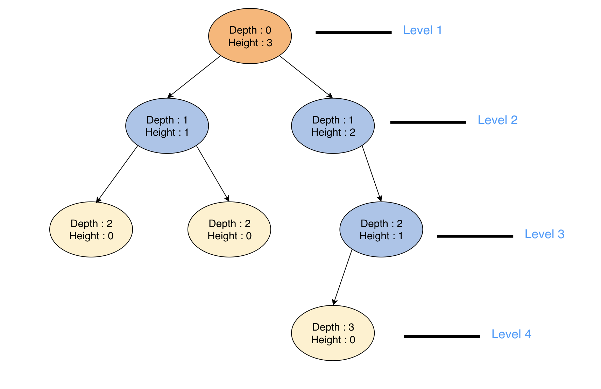

# 树(Tree)

## 术语定义(Terminology)

**Sub-tree**: For a particular non-leaf node, a collection of nodes, essentially the tree, starting from its child node. The tree formed by a node and its descendants.

**Degree of a node**: Total number of children of a node

**Length of a path**: The number of edges in a path

**Depth of a node \_n**\_: The length of the path from a node _n_ to the root node. The depth of the root node is 0.

**Level of a node \_n**\_: (Depth of a Node)+1

**Height of a node \_n**\_: The length of the path from _n_ to its deepest descendant. So the height of the tree itself is the height of the root node and the height of leaf nodes is always 0.

**Height of a Tree**: Height of its root node

&#x20;
